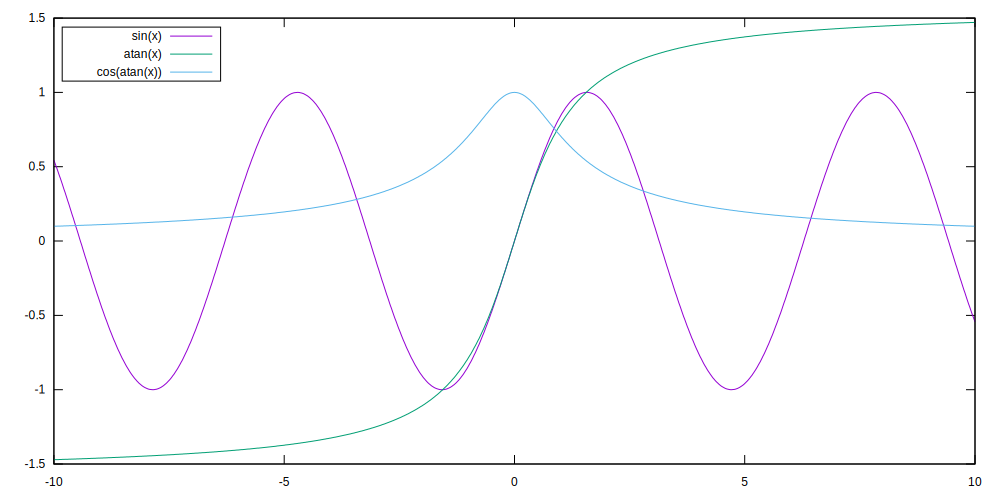

# gnuplot compiled to wasm

Experiment. I took idea from [gnuplot-in-the-browser](https://github.com/CD3/gnuplot-in-the-browser) and tried to make ES6 module distributed in npm. I tried to create minimal API with single usecase in mind - generate SVG and output it as string.

```js
import gnuplot from "gnuplot-wasm";

const script = `
  set key fixed left top vertical Right noreverse enhanced autotitle box lt black linewidth 1.000 dashtype solid
  set samples 1000, 1000
  plot [-10:10] sin(x),atan(x),cos(atan(x))`;

const { render } = await gnuplot();
const { svg } = render(script);
```

Will produce:



## Hack for WASM in Vite

```js
import gnuplot from "gnuplot-wasm";

import { createRequire } from "module";
const require = createRequire(import.meta.url);
const wasmPath = require.resolve("gnuplot-wasm/src/gnuplot.wasm");

const { render } = await gnuplot({
  locateFile: () => wasmPath,
});
```

See:

- https://github.com/vitejs/vite/issues/11694
- https://github.com/httptoolkit/brotli-wasm/issues/8
- https://github.com/sapphi-red/vite-plugin-static-copy/

### Other options

- [@hpcc-js/wasm](https://www.npmjs.com/package/@hpcc-js/wasm)
  - they wrote special function to inline binary WASM file into textual JS file
  - they use [fzstd](https://www.npmjs.com/package/fzstd) and [base91](https://github.com/Equim-chan/base91) to decode it later
- [@node-rs/xxhash-wasm32-wasi](https://www.npmjs.com/package/@node-rs/xxhash-wasm32-wasi)
  - they have `"main": "xxhash.wasi.cjs",` and ` "browser": "xxhash.wasi-browser.js",` in package.json
  - in browser they use `import __wasmUrl from './xxhash.wasm32-wasi.wasm?url'`
  - in node they use CJS and `let __wasmFilePath = __nodePath.join(__dirname, 'xxhash.wasm32-wasi.wasm')`
- here [wasm-pack#1334](https://github.com/rustwasm/wasm-pack/issues/1334) they propose to use base64
- node has experiment support for WASM modules [`--experimental-wasm-modules`](https://nodejs.org/api/esm.html#wasm-modules)
- Bun supports [WASM modules](https://bun.sh/docs/bundler/loaders#wasm)
- Vite supports [`?init`](https://vitejs.dev/guide/features#webassembly) for WASM
  - plus [vite-plugin-wasm](https://github.com/Menci/vite-plugin-wasm) implements WASM modules
- maybe [import-meta-resolve](https://www.npmjs.com/package/import-meta-resolve)
  - [vite#14405](https://github.com/vitejs/vite/discussions/14405)
  - `--experimental-import-meta-resolve`

## Build

To build locally you need `docker` and `shell` (plus `tar`, `wget`):

```sh
sh build.sh
```

## TODO

- smaller size
  - `-s MALLOC=emmalloc`
  - `-Os -closure 1`
  - https://github.com/WebAssembly/wabt
  - remove unsued features - can I leave only support for SVG?
- github action for npm deployment
- test in browser
- typescript signatures
  - `--emit-tsd gnuplot.d.ts`, but it requires Typescript, which mean I need to create custom Dcoker image with node, npm, TypeScript
- update to [gnuplot v6](https://sourceforge.net/projects/gnuplot/files/gnuplot/6.0.0/)
